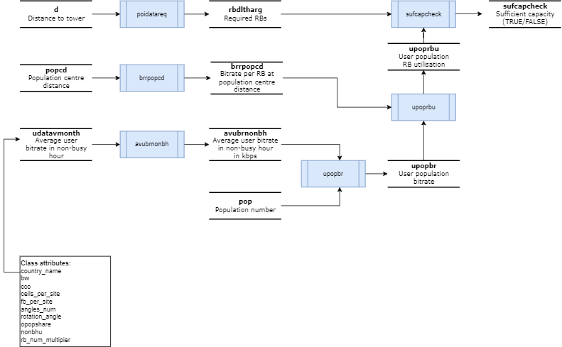

## Repository structure

```sh
mobile-network-capacity-model
├── README.md
├── app.py
├── data
│   ├── input_data
│   │   ├── ESP-1697916284-6wv8-cellsite.csv
│   │   ├── ESP-1708423221-tgah-visibility.csv
│   │   ├── MobileBB_Traffic_per_Subscr_per_Month.csv
│   │   ├── active-mobile-broadband-subscriptions_1711147050645.csv
│   │   ├── area.gpkg
│   │   ├── bwdistance_km.csv
│   │   ├── bwdlachievbr_kbps.csv
│   │   ├── bwrsrp_dbm.csv
│   │   ├── bwulachievbr_kbps.csv
│   │   ├── mobile-broadband-internet-traffic-within-the-country_1711147118571.csv
│   │   └── population.tif
│   └── output_data
│       ├── MobileBB_Traffic_per_Subscr_per_Month.csv
│       └── network_capacity.csv
├── environment.yml
├── logs
│   └── app_timestamp.log
├── mobile_capacity
│   ├── capacity.py
│   └── spatial.py
├── notebooks
│   └── analyses.ipynb
└── tests
    ├── confest.py
    └── unit
        └── test_class.py
```

## Summary of methods



## Installation Steps

1. **Clone the Repository:**
    Clone the repository to your local machine using the following command:

```bash
git clone git@ssh.dev.azure.com:v3/ITUINT/ConnectivityToolkit/mobile-network-capacity-model
```

2. **Navigate to the directory:**
```bash
cd mobile-network-capacity-model
```

3. **Create a virtual environment with the required dependencies via [conda](https://www.anaconda.com/download):**<br><br>
```bash
conda install -n base conda-libmamba-solver
conda env create --file environment.yml --solver libmamba
conda activate mobilecapacityenv
```

4. **Run analysis in notebooks**<br><br>
Run the analysis in `notebooks/app.ipynb`

5. **Deploy streamlit app locally**<br><br>
```bash
conda activate mobilecapacityenv
streamlit run app.py
```
Use keyborad shortcut `Ctrl+C` to terminate the local deployment.

## Keeping analysis outputs private

To ensure that all Jupyter Notebook outputs are cleared before committing changes to the repository, we use `nbstripout`. By following these instructions, contributors to your project will ensure that Jupyter Notebook outputs are cleared before committing changes, helping to keep the repository clean and free of unnecessary data. Follow the steps below to install and enable `nbstripout`.

First, you'll need to install nbstripout. You can do this using `pip`:

```bash
pip install nbstripout
```

Once `nbstripout` is installed, you need to enable it for your Git repository. Run the following command in the root directory of your repository:

```bash
nbstripout --install
```

This will configure nbstripout to automatically strip output from Jupyter Notebooks when you commit them to your repository.

```bash
nbstripout --status
```